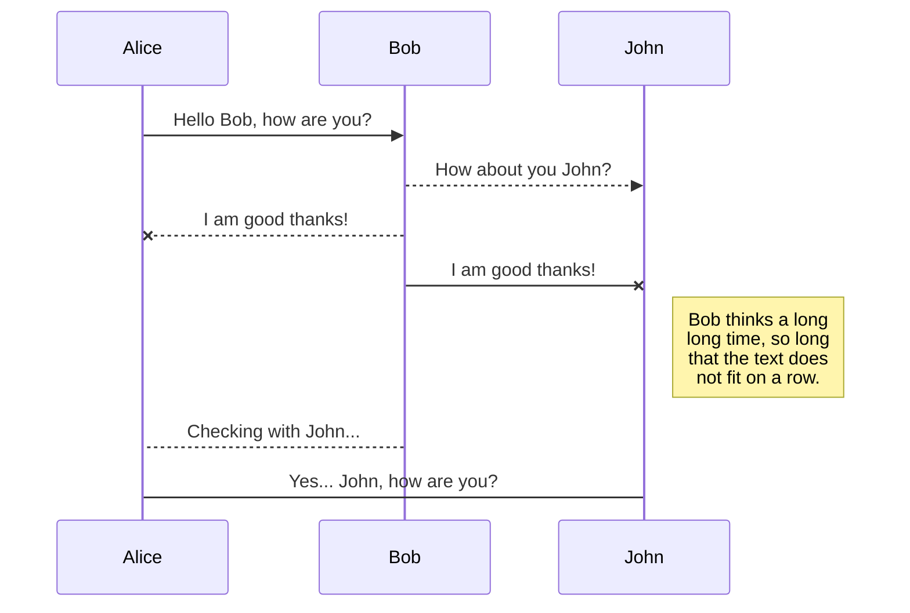
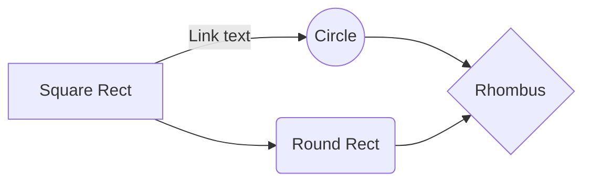

# Java & Test Automation Course - Final

John Bryce 2019.
This project is my personal work for the Java Amazon Project.

## Table of contents
* [_01_Test scenarios for Add New Address on Amazon](#TestscenariosforAddNewAddressonAmazon)
* [_02_Test scenarios for Footer Page on Amazon](#_02_TestscenariosforFooterPageonAmazon)
* [_03_Test scenarios for Forgot Password](#_03_TestscenariosforForgotPassword)
* [_04_Test scenarios for Language Settings on Amazon](#_04_TestscenariosforLanguageSettingsonAmazon)
* [_05_Test Scenarios Login Page](#_05_TestScenariosLoginPage)
* [_06_Test scenarios for Registration Page](#_06_TestscenariosforRegistrationPage)
* [_07_Test scenarios for Results Sidebar on Amazon](#_07_TestscenariosforResultsSidebaronAmazon)
* [_08_Test scenarios for Search an Item and Add Quantity](#_08_TestscenariosforSearchanItemandAddQuantity)
* [_09_Test scenarios for Search on Amazon](#_09_TestscenariosforSearchonAmazon)
* [_010_Test scenarios for Shopping Cart Counter](#_010_TestscenariosforShoppingCartCounter)
* [_011_Test scenarios for Site Preferences on Amazon](#_011_TestscenariosforSitePreferencesonAmazon)
* [_012_Test scenarios for Add to List](#_012_TestscenariosforAddtoList)
* [_013_Tell Us How We Can Improve Feedback](#_013_TellUsHowWeCanImproveFeedback)

## [_01_Test scenarios for Add New Address on Amazon](https://github.com)

## Screenshots

## [_02_Test scenarios for Footer Page on Amazon](https://github.com)
## Screenshots

## [_03_Test scenarios for Forgot Password](https://github.com)
## Screenshots

## [_04_Test scenarios for Language Settings on Amazon](https://github.com)
## Screenshots

## [_05_Test Scenarios Login Page](https://github.com)
## Screenshots

## [_06_Test scenarios for Registration Page](https://github.com)
## Screenshots

## [_07_Test scenarios for Results Sidebar on Amazon](https://github.com)
## Screenshots

## [_08_Test scenarios for Search an Item and Add Quantity](https://github.com)
## Screenshots

## [_09_Test scenarios for Search on Amazon](https://github.com)
## Screenshots

## [_010_Test scenarios for Shopping Cart Counter](https://github.com)
## Screenshots

## [_011_Test scenarios for Site Preferences on Amazon](https://github.com)
## Screenshots

## [_012_Test scenarios for Add to List](https://github.com)
## Screenshots

## [_013_Tell Us How We Can Improve Feedback](https://github.com)
## Screenshots

## Technologies
* Tech 1 - version 1.0

## Setup
Describe how to install / setup your local environement / add link to demo version.

## Code Examples
Show examples of usage:
`put-your-code-here`

## Features
List of features ready and TODOs for future development
* Awesome feature 1

To-do list:
* Wow improvement to be done 1

## Status
Project is: _in progress_, _finished_, _no longer continue_ and why?

## Inspiration
Add here credits. Project inspired by..., based on...

## Contact
Created by [@lbendror](https://github.com/lbendror)
By site [[https://stackedit.io/](https://stackedit.io/)]

# Welcome to StackEdit!
Hi! I'm your first Markdown file in **StackEdit**

# Files
StackEdit

## Create files and folders
The **file**

## Export a file
by clicking **Export to disk** in the menu.

# Synchronization
Synchronization 
- The file synchronization will keep one file of the workspace synced with one or multiple files in **Google Drive**, **Dropbox** or **GitHub**.
	> Before starting to sync files, you must link an account in the **Synchronize** sub-menu.

## Save a file
You can save any file of the workspace to **Google Drive**, **Dropbox** or **GitHub** by opening the **Synchronize** sub-menu and clicking **Save on**. Even if a file in the workspace is already synced, you can save it to another location. StackEdit can sync one file with multiple locations and accounts.

## Synchronize a file
If you just have modified your file and you want to force syncing, click the **Synchronize now** button in the navigation bar.

> **Note:** The **Synchronize now** button is disabled if you have no file to synchronize.

## Manage file synchronization
Since one file 

# Publication
Publishing in StackEdit makes it simple for you to publish online your files. Once you're happy with a file, you can publish it to different hosting platforms like **Blogger**, **Dropbox**, **Gist**, **GitHub**, **Google Drive**, **WordPress** and **Zendesk**. With [Handlebars templates](http://handlebarsjs.com/), you have full control over what you export.

> Before starting to publish, you must link an account in the **Publish** sub-menu.

## Publish a File
You can publish your file by opening the **Publish** sub-menu and by clicking **Publish to**. For some locations, you can choose between the following formats:

- Markdown: publish the Markdown text on a website that can interpret it (**GitHub** for instance),
- HTML: publish the file converted to HTML via a Handlebars template (on a blog for example).

## Update a publication
After publishing, StackEdit keeps your file linked to that publication which makes it easy for you to re-publish it. Once you have modified your file and you want to update your publication, click on the **Publish now** button in the navigation bar.

> **Note:** The **Publish now** button is disabled if your file has not been published yet.

## Manage file publication
Since one file can be published to multiple locations, you can list and manage publish locations by clicking **File publication** in the **Publish** sub-menu. This allows you to list and remove publication locations that are linked to your file.

# Markdown extensions
StackEdit extends the standard Markdown syntax by adding extra **Markdown extensions**, providing you with some nice features.

> **ProTip:** You can disable any **Markdown extension** in the **File properties** dialog.

## SmartyPants
SmartyPants converts ASCII punctuation characters into "smart" typographic punctuation HTML entities. For example:

|                |ASCII                          |HTML                         |
|----------------|-------------------------------|-----------------------------|
|Single backticks|`'Isn't this fun?'`            |'Isn't this fun?'            |
|Quotes          |`"Isn't this fun?"`            |"Isn't this fun?"            |
|Dashes          |`-- is en-dash, --- is em-dash`|-- is en-dash, --- is em-dash|

## KaTeX
You can render LaTeX mathematical expressions using [KaTeX](https://khan.github.io/KaTeX/):

The *Gamma function* satisfying $\Gamma(n) = (n-1)!\quad\forall n\in\mathbb N$ is via the Euler integral

$$
\Gamma(z) = \int_0^\infty t^{z-1}e^{-t}dt\,.
$$

> You can find more information about **LaTeX** mathematical expressions [here](http://meta.math.stackexchange.com/questions/5020/mathjax-basic-tutorial-and-quick-reference).

## UML diagrams
You can render UML diagrams using [Mermaid](https://mermaidjs.github.io/). For example, this will produce a sequence diagram:

And this will produce a flow chart:

